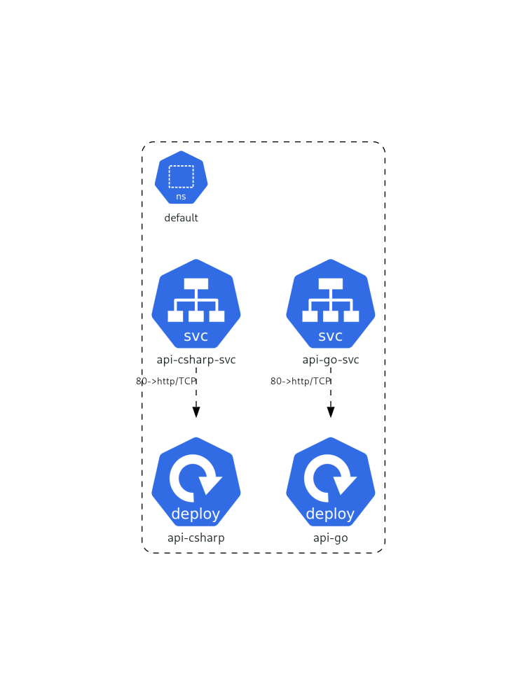
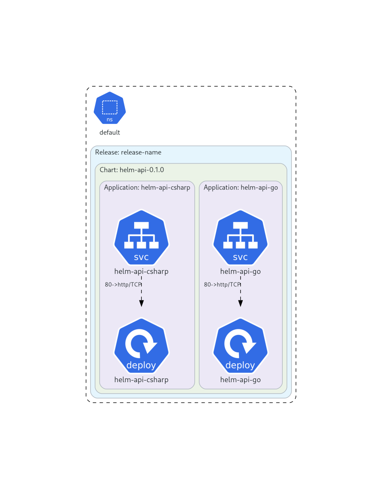

# argocd-lab

This repository contains a collection of labs and exercises designed to help users learn and practice using Argo CD, a declarative, GitOps continuous delivery tool for Kubernetes.

## Contents

Kubernetes Manifests and Helm Charts


| Directory | Description | ArgoCD Application |
| --- | --- | --- |
| k8s/api | Kubernetes manifests for the API service | [application.yaml](k8s/application.yaml) |
| k8s/helm-api | Helm charts for the API service | [helm-application.yaml](k8s/helm-application.yaml) |
| k8s/kustomize-api | Kustomize configurations for the API service | [kustomize-application.yaml](k8s/kustomize-application.yaml) |

## Diagrams

You can generate diagrams of the Kubernetes manifests using [KubeDiagrams](https://github.com/philippemerle/KubeDiagrams)

k8s/api

```sh
docker run -v "$(pwd)":/work philippemerle/kubediagrams kube-diagrams -o images/api.png k8s/api/deployment.yaml
```

k8s/kustomize-api

```sh
kubectl kustomize ./k8s/kustomize-api/ | docker run -i -v "$(pwd)":/work philippemerle/kubediagrams kube-diagrams - -o images/kustomize-api.png
```

k8s/helm-api

```sh
helm template ./k8s/helm-api | docker run -i -v "$(pwd)":/work philippemerle/kubediagrams kube-diagrams - -o images/helm-api.png
```

Generated Diagrams

| k8s/api | k8s/kustomize-api | k8s/helm-api |
| --- | --- | --- |
|  |  | 
